# Freelance Platform Analysis

This repository contains an in-depth analysis of freelance platform data, focusing on earnings distribution, freelancer performance, platform-specific trends, and client behavior. The visualizations provide actionable insights for freelancers and businesses to make data-driven decisions.

## Table of Contents
- [Overview](#overview)
- [Visualizations](#visualizations)
  - [Total Earnings by Client Region](#total-earnings-by-client-region)
  - [Total Earnings by Job Category](#total-earnings-by-job-category)
  - [Top 10 Freelancers by Earnings](#top-10-freelancers-by-earnings)
  - [Rehire Rate vs Client Rating](#rehire-rate-vs-client-rating)
  - [Marketing Spend by Platform](#marketing-spend-by-platform)
  - [Job Duration Distribution by Project Type](#job-duration-distribution-by-project-type)
  - [Freelancer Clusters](#freelancer-clusters)
  - [Distribution of Hourly Rates by Platform](#distribution-of-hourly-rates-by-platform)
  - [Average Hourly Rate by Platform](#average-hourly-rate-by-platform)
  - [Average Job Success Rate by Platform](#average-job-success-rate-by-platform)
  - [Distribution of Hourly Rates](#distribution-of-hourly-rates)
  - [Correlation Heat Map](#correlation-heat-map)
- [Usage](#usage)
- [Contributing](#contributing)

---

## Overview

This project analyzes data from various freelance platforms to identify trends and patterns in freelancer performance, platform spending, and client behavior. The visualizations aim to assist freelancers and businesses in making informed decisions.

---

## Visualizations

### Total Earnings by Client Region

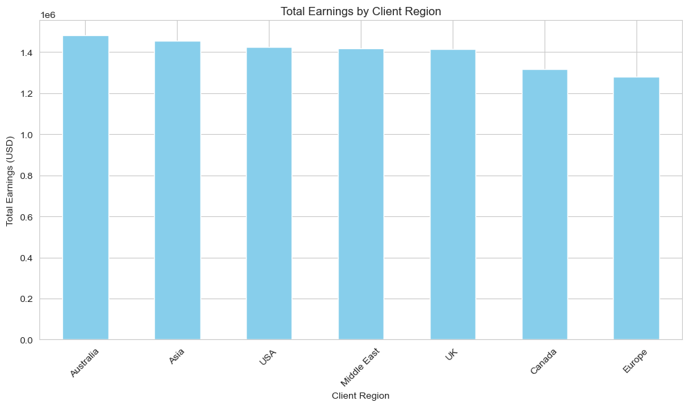

This bar chart illustrates the total earnings generated across different client regions. Key observations include:
- Earnings are relatively consistent across regions, with slight variations.
- The highest earnings are observed in **Australia** and **Asia**, while other regions like **Canada** and **Europe** follow closely.

---

### Total Earnings by Job Category

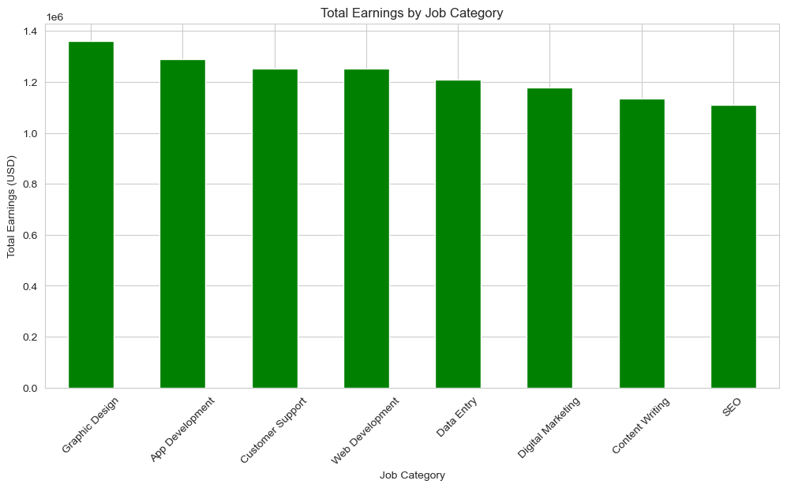

This bar chart highlights the distribution of total earnings across various job categories. Insights include:
- **Graphic Design** and **App Development** generate the highest earnings.
- Categories like **SEO** and **Content Writing** show slightly lower earnings compared to others.

---

### Top 10 Freelancers by Earnings

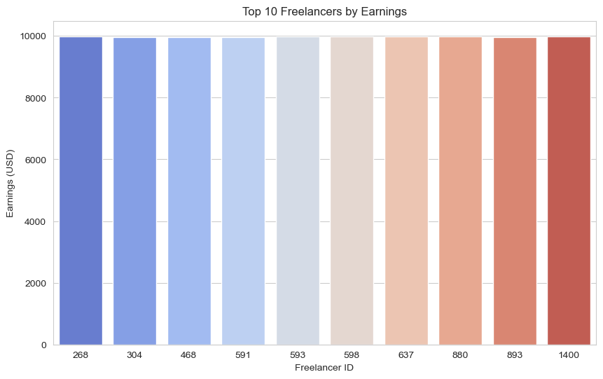

This horizontal bar chart showcases the top 10 freelancers based on their total earnings. Key takeaways:
- The top freelancers have nearly identical earnings, with a maximum of approximately $10,000.
- Freelancer IDs **268**, **304**, and **468** are among the top performers.

---

### Rehire Rate vs Client Rating

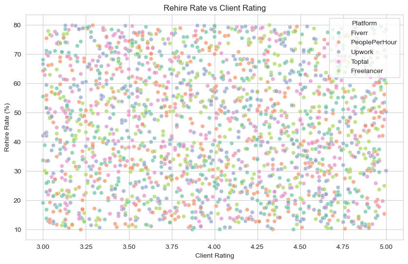

This scatter plot examines the relationship between client ratings and rehire rates across different platforms. Observations:
- A positive trend is visible: higher client ratings generally correlate with higher rehire rates.
- Platforms like **Upwork**, **Fiverr**, and others show similar patterns in client behavior.

---

### Marketing Spend by Platform

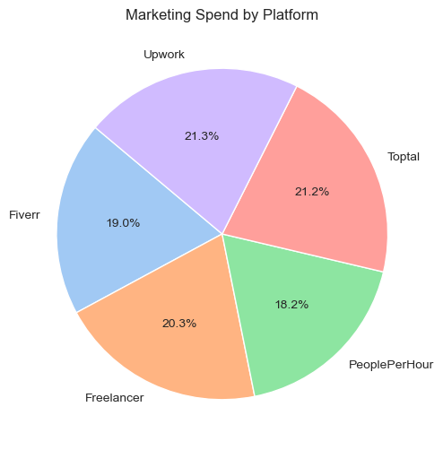

This pie chart breaks down the marketing spend across major freelance platforms. Key observations include:
- **Upwork** and **Toptal** have the highest marketing spend at 21.3% and 21.2%, respectively.
- **PeoplePerHour** accounts for the smallest share at 18.2%.
- The distribution indicates competitive spending among platforms to attract clients and freelancers.

---

### Job Duration Distribution by Project Type

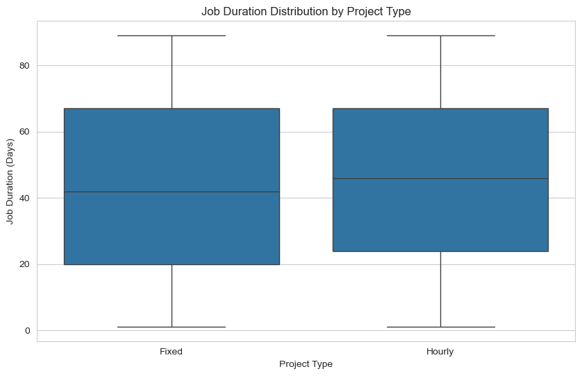

This box plot compares job durations for fixed-price and hourly projects. Insights include:
- Median job duration is similar for both project types, around **40 days**.
- Hourly projects exhibit slightly more variability in duration compared to fixed-price projects.
- Both project types have a maximum duration of approximately **80 days**.

---

### Freelancer Clusters

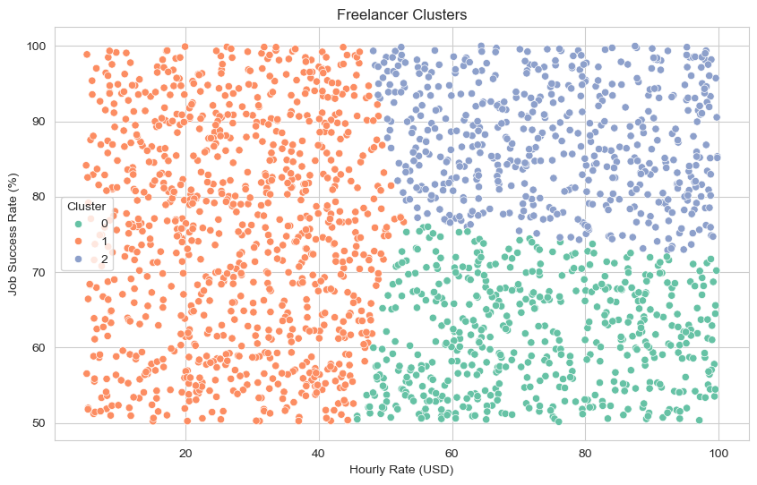

This scatter plot clusters freelancers based on their hourly rates and job success rates. Key takeaways:
- Three distinct clusters are identified:
  - Cluster 0: Freelancers with lower hourly rates but moderate-to-high success rates.
  - Cluster 1: Freelancers with mid-range hourly rates and varying success rates.
  - Cluster 2: High-rate freelancers with consistently high success rates.
- The clustering highlights diverse freelancer profiles and their potential market positioning.

---

### Distribution of Hourly Rates by Platform

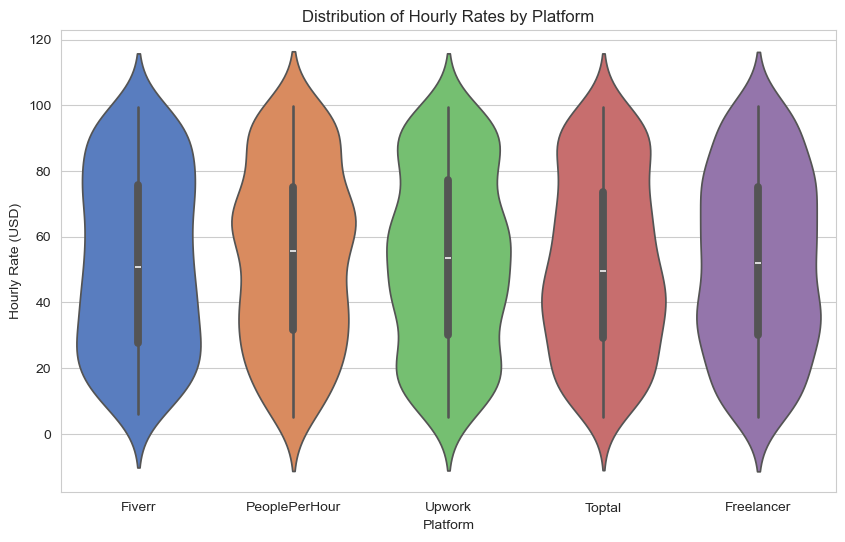

This violin plot visualizes the distribution of hourly rates across different platforms. Observations include:
- **Toptal** has the highest median hourly rate, with a broader range extending up to $120/hour.
- **Fiverr** has the lowest median rate but also exhibits significant variability.
- Platforms like **Upwork** and **Freelancer** show comparable distributions, with median rates around $50/hour.

---

### Average Hourly Rate by Platform

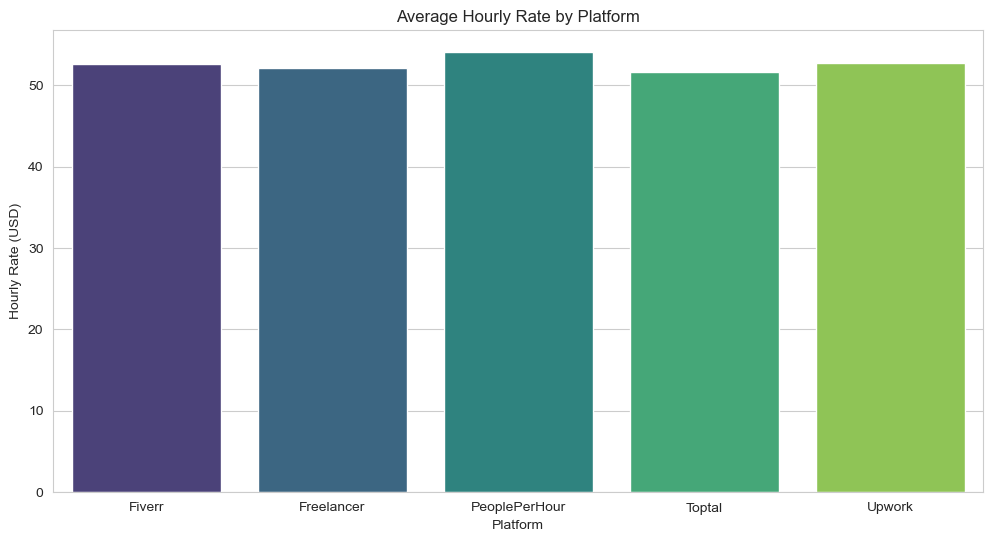

This bar chart compares average hourly rates across platforms. Key insights include:
- All platforms have similar average hourly rates, hovering around $50/hour.
- This uniformity suggests a competitive market with standardized pricing.

---

### Average Job Success Rate by Platform

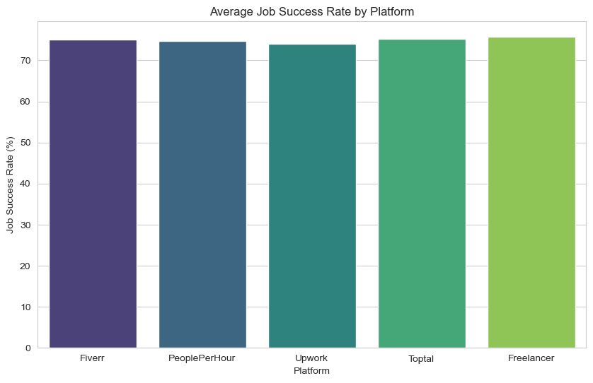

This bar chart compares average job success rates across platforms. Observations:
- Success rates are fairly uniform across platforms, averaging around 70%.
- This consistency indicates that platform-specific factors may not significantly influence freelancer performance.

---

### Distribution of Hourly Rates

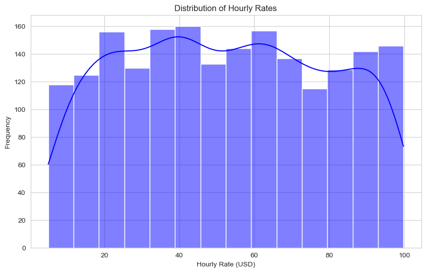

This histogram visualizes the overall distribution of freelancer hourly rates. Key takeaways:
- Most freelancers charge between $20-$80/hour.
- A smaller proportion of freelancers charge above $100/hour or below $20/hour.

---

### Correlation Heat Map

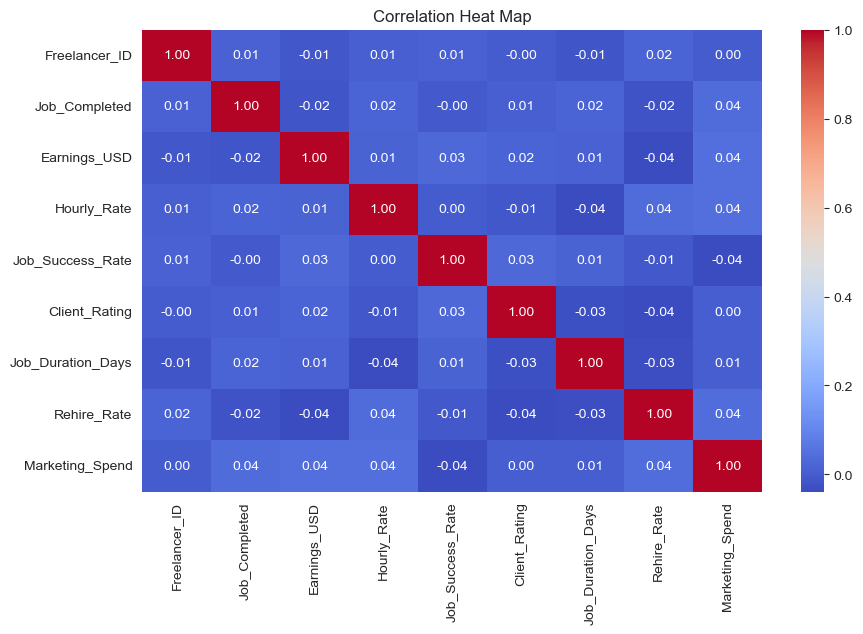

This heat map shows correlations between various metrics such as hourly rate, job success rate, client rating, and marketing spend. Key observations include:
- Strong correlations are observed between metrics like job success rate and rehire rate.
- Marketing spend shows little correlation with other variables.
